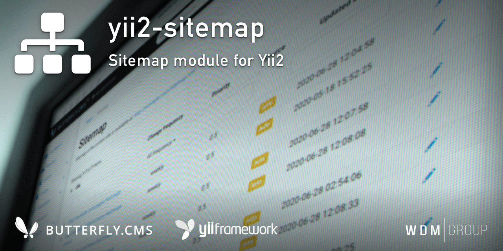

# Yii2 Sitemap
The module polls supported data models and displays links to their representations for front-ends and search engines.

You can expand or replace the list of supported models through the module configuration.
In your model class, which you include in the site map module, you need to provide a selection by publication status (for example), as well data models must have the required public attribute `in_sitemap` and public method` getPublished() `which should return models with such required keys as: `url`,` updated_at`.

Autogenerated sitemap resolving at http://example.com/sitemap.xml

Sitemap module monitors the saving, changing or deleting event for the supported models and clean the cache which the site map is formed, thus actualizing it.
In addition, you can add/edit and delete the URL of sitemap in manual mode.

> Be careful when adding URLs manually for pages of dynamic content, since by deleting such a resource the link to it will still be on the site map.

This module is an integral part of the [Butterfly.СMS](https://butterflycms.com/) content management system, but can also be used as an standalone extension.

Copyrights (c) 2019-2020 [W.D.M.Group, Ukraine](https://wdmg.com.ua/)

# Requirements 
* PHP 5.6 or higher
* Yii2 v.2.0.35 and newest
* [Yii2 Base](https://github.com/wdmg/yii2-base) module (required)
* [Yii2 SelectInput](https://github.com/wdmg/yii2-selectinput) widget
* [Yii2 Options](https://github.com/wdmg/yii2-options) module (optionality)
* [Yii2 Pages](https://github.com/wdmg/yii2-pages) module (support)
* [Yii2 News](https://github.com/wdmg/yii2-news) module (support)
* [Yii2 Blog](https://github.com/wdmg/yii2-blog) module (support)

# Installation
To install the module, run the following command in the console:

`$ composer require "wdmg/yii2-sitemap"`

After configure db connection, run the following command in the console:

`$ php yii sitemap/init`

And select the operation you want to perform:
  1) Apply all module migrations
  2) Revert all module migrations
  3) Flush sitemap cache

# Migrations
In any case, you can execute the migration and create the initial data, run the following command in the console:

`$ php yii migrate --migrationPath=@vendor/wdmg/yii2-sitemap/migrations`

# Configure
To add a module to the project, add the following data in your configuration file:

    'modules' => [
        ...
        'sitemap' => [
            'class' => 'wdmg\sitemap\Module',
            'routePrefix' => 'admin',
            'supportModels'  => [  // list of supported models for displaying a sitemap
                'pages' => 'wdmg\pages\models\Pages',
                'news' => 'wdmg\news\models\News',
            ],
            'cacheExpire' => 43200, // sitemap cache lifetime, `0` - for not use cache
            'defaultFrequency' => 'weekly', // default update frequency
            'defaultPriority' => 0.5, // default update priority
            'sitemapRoute' => '/' // default route to rendered sitemap.xml (use "/" - for root)
        ],
        ...
    ],

# Routing
Use the `Module::dashboardNavItems()` method of the module to generate a navigation items list for NavBar, like this:

    <?php
        echo Nav::widget([
        'options' => ['class' => 'navbar-nav navbar-right'],
            'label' => 'Modules',
            'items' => [
                Yii::$app->getModule('sitemap')->dashboardNavItems(),
                ...
            ]
        ]);
    ?>

# Status and version [ready to use]
* v.1.1.4 - Update dependencies, README.md
* v.1.1.3 - Update README.md and dependencies
* v.1.1.2 - Added support for Blog module, fixed models items retrieved
* v.1.1.1 - Added pagination
* v.1.1.0 - Added CRUD for edit sitemap URL`s
* v.1.0.0 - Added support for Pages and News models
* v.0.0.1 - Initial commit. Added console, migrations and controller
